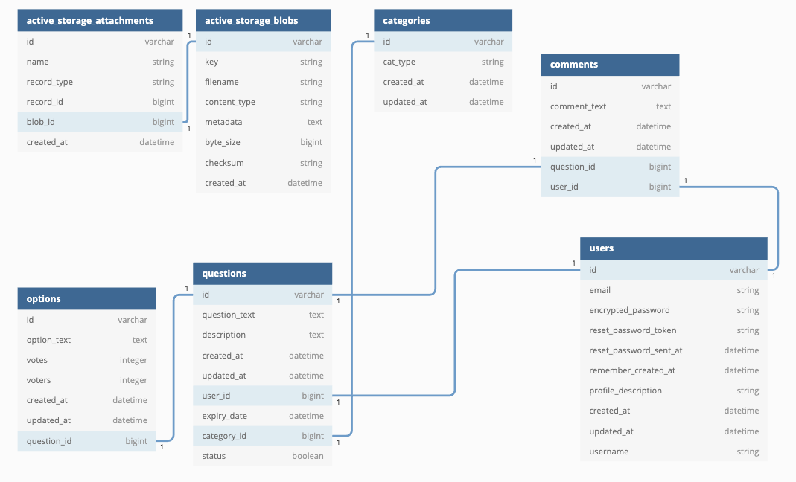
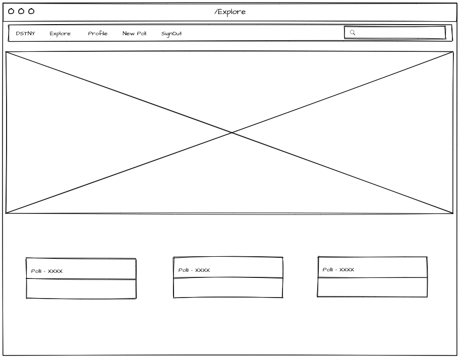
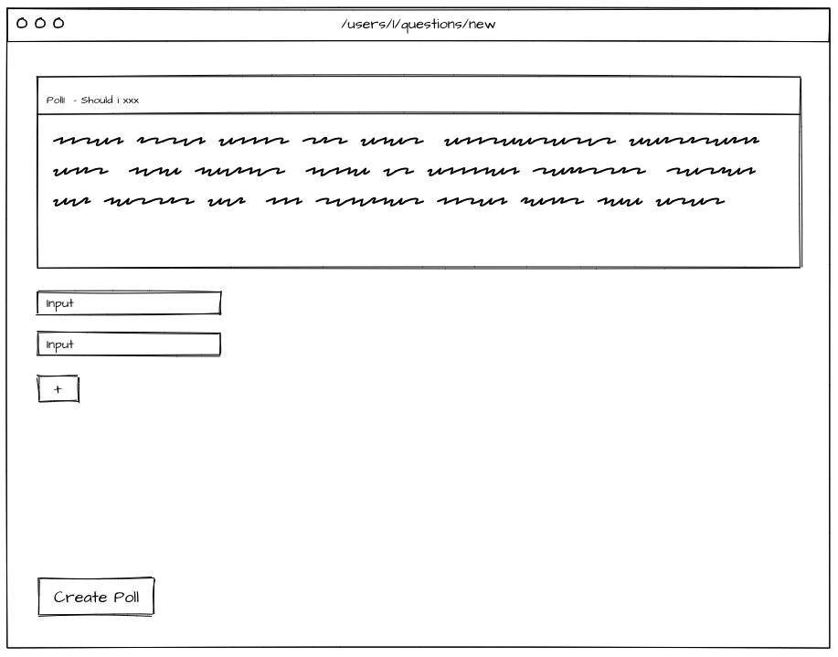
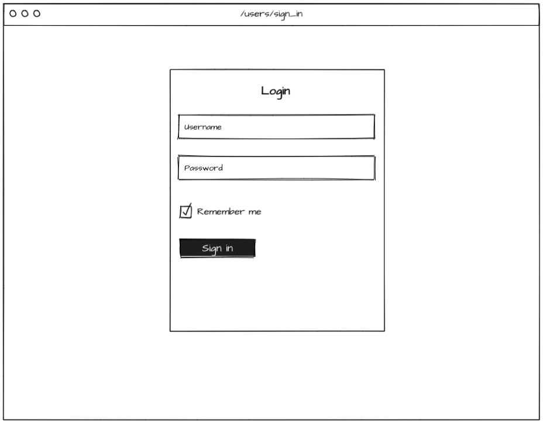
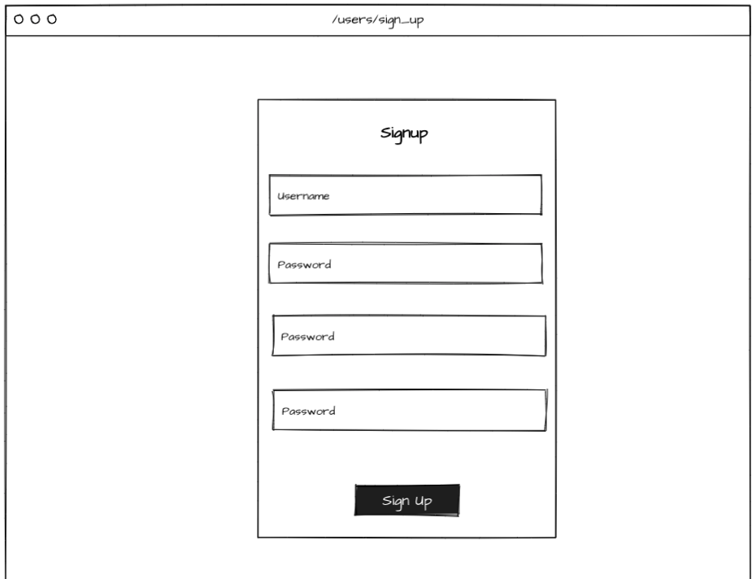
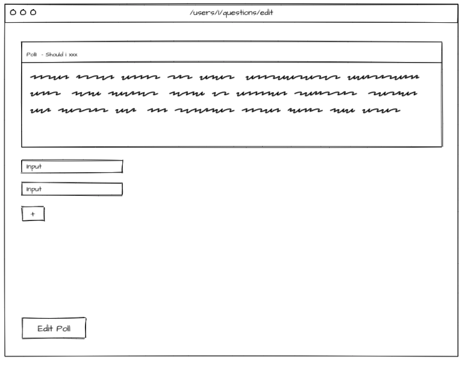
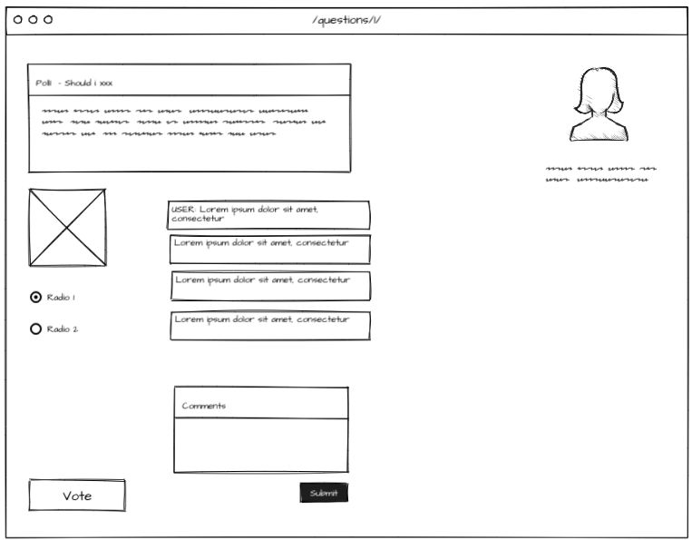
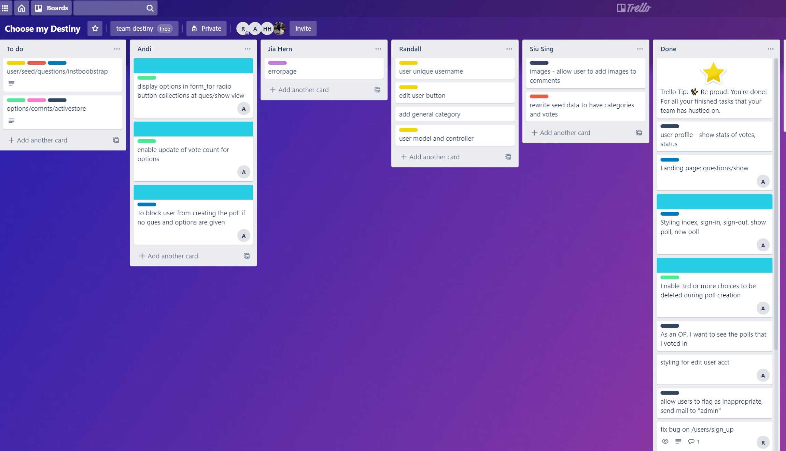

# README

## Introduction
SEI 23 - Project 3
Database is hosted here: dstny.herokuapp.com/

#### App Objectives
- Decide-for-me app, user post a question, other users can vote yes/no and/or add comments for that particular post 
- Users (OP) can post a question - e.g. chicken rice or fish soup?
- Other users (voters) can vote on decisions available
- Users may also be able to follow one another (following can serve as a filter)

#### Project Objectives
**Technical Requirements**
- Use Ruby on Rails and Active Record to build an application
- Create an application using at least 2 related models and an additional user model with authentication
- Include all major CRUD functions for at least one of those models
- Craft thoughtful user stories together, as a team
- Manage team contributions and collaboration using a standard Git flow on Github
- Layout and style your front-end with clean & well-formatted CSS, with or without a framework.
- Deploy your application online so it's publically accessible

**Required Deliverables**
-  working app, built by the whole team, hosted somewhere on the internet
-  A link to your hosted working app in the URL section of your Github repo
-  A team git repository hosted on Github, with a link to your hosted project, and frequent commits from every team member dating back to the very beginning of the project.
-  A readme.md file with:
   -  Explanations of the technologies used
   -  A couple paragraphs about the general approach you took
   -  Installation instructions for any dependencies
   -  Link to your user stories – who are your users, what do they want, and why?
   -  Link to your wireframes – sketches of major views / interfaces in your application
   -  Descriptions of any unsolved problems or major hurdles your team had to overcome
   - A presentation.md of "slides" that walk through a demo of your app.

## Breakdown
#### Minimum Viable Product Features
- Models: User, Question, Comments
- User as an OP can create a new question for voters to vote on
- Questions can include 1 image and 2 options for users to vote on
- Users can vote on questions posted by the OP
- Users can leave comments on the question

#### User Stories & Approach
##### Sprint 1 - Fri
- As a voter, I would like to view all the available polls available for voting
- As an OP, I would like to create a poll to get help from others to decide what i should do
- As an OP, I would like to set an expiry date/time on my poll

##### Sprint 2 - Sat
- As a voter, I would like to add comments to the poll
- As an OP, I would like to give an update on action I did, by posting a comment of the end result
- As an OP, I would like to delete my poll
- As a general user, I would like to upload an avatar to my profile

##### Sprint 3 - Sun
- As an OP, I would like to add images to my poll questions to allow users to understand more about what i am asking
- As a voter, I would like to vote on a poll to help the OP decide his/her next step
- As a voter, I should not be allowed to vote on a poll more than once
- As a voter, I want to be able to report a poll for inappropriate content
- As a general user, I would like to know the current/final results of the poll. Can be a simple display.
- Visualization planned for later days
- As a general user, I would like to delete my comments from the past

##### Sprint 4 - Mon
- As an OP, I would like to view all my last polls created by me for future reference
- As an OP, the new poll that i am creating should be validated appropriately - expires in the future, has options, has a question

##### Sprint 5 - Tue
- As a general user, I would like to know if the comment is from the OP. OP comments should have special styling or some kind of indication
- As an OP, I would like to know who voted for which option
- As an OP, I would like to add categories to my poll - done
- As a user, I explore polls by categories - will be done

##### Sprint 6 - Wed
- As an OP, I would like to be able to mark the end of the poll, and prevent any more voting or commenting
- As an admin, I would like to be able to log in and do/see “admin” stuff
- Requires new user type flag with default as user
- Allow removal of poll
- Admin can delete polls and comments
- Admin can edit polls, description and images
- As a user, I would like to click on a username and view the users’s profile
- Consistent styling
- Attach images to my comments

##### Sprint 7 - Thu
- Merge final PRs
- Presentation prep and flow
- ReadMe.md & 404 Page
- Seed data / Users / Questions / Comments / images / Categories / options / votes

#### Database Design
- Ruby version - 2.7.1

#### Furthers
- Set deadline for poll (completed)
- Users can report a question for inappropriate content and admin receives a email alert (completed)
- Users can leave media in the comments (completed)
- Admins can edit/delete questions that dont belong to them (completed)
- Questions can include multiple images and multiple options for users to vote on (completed)
- Questions can include tags for more user friendly categorizations (completed)
- Users can end poll (completed)
- Users as voters can “follow” other users they are interested in keeping track of poll 
- OP can also leave a comment on the question as a follow up on the action taken

#### Further Furthers
- Users can chat with each other in real time
- Users as OPs can be incentivized if they take the action chosen by the majority
- Users as Voters can be incentivized to vote

#### Bugs & Issues Faced
- Pull requests required entire team effort to resolve due to overlapping conflicts
- link_to overwrote clickable container 